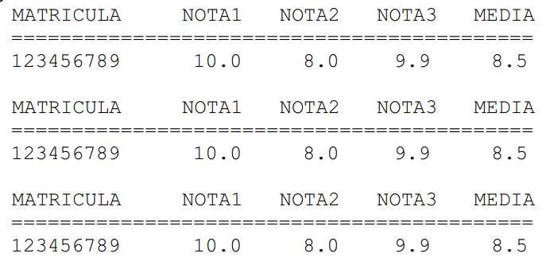
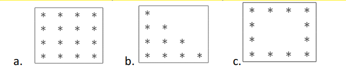

# Sobre

Este repositório em C++ foi desenvolvido para adicionar a resolução dos exercícios da instrução prática 7 da Residência em Software promovido pela CEPEDI em parceria com a UESC.

# 📑Instruções práticas

 > Exercício 1: Escreva um programa em C++ que imprima na tela os números de 1 a 100. Porém, para múltiplos de 3, o programa deve imprimir "Fizz", e para múltiplos de 5, deve imprimir "Buzz". Para números que são múltiplos de ambos, imprimir "FizzBuzz".

> Exercício 2: Escreva um programa em C++ que leia um número inteiro e verifique se ele é um palíndromo. Um número é palíndromo se ele permanece o mesmo quando seus dígitos são invertidos 

> Exercício 3: Escreva um programa em C++ que leia um número inteiro e imprima todos os divisores desse número.

> Exercício 4: Escreva um programa em C++ que imprima todos os números primos de 1 a 100.

> Exercício 5: Escreva um programa em C++ que simule um jogo de adivinhação. O programa deve gerar um número aleatório entre 1 e 100, e o usuário deve tentar adivinhar esse número. O jogo deve informar se o palpite está alto, baixo ou correto, e continuar até que o usuário acerte o número.

> Exercício 6: Desenvolva um programa que receba a matrícula (apenas números) e 3 notas de um grupo de alunos. A cada aluno cadastrado o programa deve perguntar se deseja prosseguir com outro. Em seguida, calcule a média de cada aluno e imprima os dados da seguinte forma:

> Exercício 7: Escreva um programa em C++ que gere e imprima o seguinte padrão de caracteres alfanuméricos, onde o número fornecido pelo usuário é a altura do padrão:
A 
BC 
DEF 
GHIJ 
KLMNO

> Exercício 8: Escreva um programa que imprima os seguintes padrões de acordo com a entrada, que define a altura do padrão. Para os exemplos abaixo a entrada foi 4:

> Exercício 9: Escreva um programa em C++ que leia um número inteiro e determine se ele é um número perfeito. Um número perfeito é aquele cuja soma dos seus divisores, excluindo ele mesmo, é igual ao próprio número.

> Exercício 10: Escreva um programa em C++ que leia um número inteiro e imprima a sequência de Fibonacci até o número fornecido pelo usuário.

> Exercício 11: Escreva um programa em C++ que leia um número inteiro e verifique se ele é um número armstrong. Um número armstrong (ou narcisista) é um número que é igual à soma de seus próprios dígitos elevados à quantidade de dígitos. Por exemplo, 153 é um número armstrong porque 1³ + 5³ + 3³ = 153.

# Autores

| [ Lucas dos Santos Silva](https://github.com/eulucasilva) | 
|:-------------------------------------------------------------------------------------------------------------------------------------------------:|